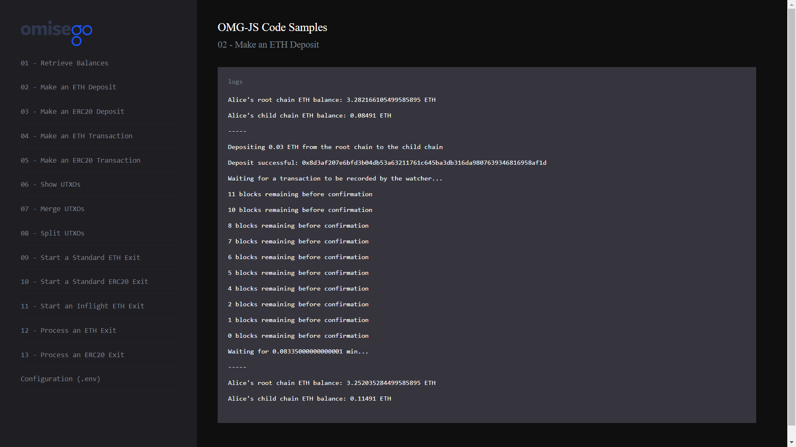

# Deposit ETH to the OMG Network

_By the end of this tutorial you should know how to deposit ETH to the root chain Plasma smart contract for subsequent use on the OMG network._

## Intro

The example uses a `deposit` function provided by the `omg-js` library to deposit ETH to the root chain smart contract.

## Prerequisites

- Any amount of ETH in Alice's Web3 wallet. If you're using pre-defined `.env` configurations for Alice and Bob, the wallet should contain test ETH. Otherwise, top it up with [Ropsten faucet](https://faucet.metamask.io/) (for testnet) or actual ETH (for mainnet).

## Steps

1. App setup
2. Logging root chain and child chain ETH balances for Alice
3. Depositing ETH from the root chain to the child chain
4. Recording transaction by the Watcher

### 1. App setup

You can find the full Javascript segment of this tutorial in [deposit-eth.js](./deposit-eth.js) file. The first lines define dependent libraries, set up configs for child chain and root chain, define wallet's data to be used during the sample.

```
import BigNumber from "bn.js";
import Web3 from "web3";
import { ChildChain, RootChain, OmgUtil } from "@omisego/omg-js";
import wait from "../helpers/wait.js";
import config from "../../config.js";

const web3 = new Web3(new Web3.providers.HttpProvider(config.eth_node), null, {
  transactionConfirmationBlocks: 1,
});
const rootChain = new RootChain({
  web3,
  plasmaContractAddress: config.plasmaframework_contract_address,
});
const childChain = new ChildChain({
  watcherUrl: config.watcher_url,
  watcherProxyUrl: config.watcher_proxy_url,
  plasmaContractAddress: config.plasmaframework_contract_address,
});
const aliceAddress = config.alice_eth_address;
const alicePrivateKey = config.alice_eth_address_private_key;
const depositAmount = new BigNumber(
  web3.utils.toWei(config.alice_eth_deposit_amount, "ether")
);
```

### 2. Logging root chain and child chain ETH balances for Alice

Logging balances helps to see the changes in the wallet addresses before and after depositing funds. For more detailed example, please refer to [Retrieve Balances](../01-balances/README.md) sample.

```
async function logBalances() {
  const rootchainBalance = await web3.eth.getBalance(aliceAddress);
  const childchainBalanceArray = await childChain.getBalance(aliceAddress);
  const ethObject = childchainBalanceArray.find(
    (i) => i.currency === OmgUtil.transaction.ETH_CURRENCY
  );
  const childchainETHBalance = ethObject
    ? `${web3.utils.fromWei(String(ethObject.amount))} ETH`
    : "0 ETH";

  console.log(
    `Alice's root chain ETH balance: ${web3.utils.fromWei(
      String(rootchainBalance),
      "ether"
    )} ETH`
  );
  console.log(`Alice's child chain ETH balance: ${childchainETHBalance}`);
}
```

Example output:

```
Alice's root chain ETH balance: 4.36180962350024 ETH

Alice's child chain ETH balance: 0.606903 ETH

```

### 3. Depositing ETH from the root chain to the child chain

A typical deposit uses `deposit` function provided by the `Rootchain` module of the `omg-js` library.

If a transaction is successful, you will see a unique `transactionHash` that you can verify on Ethereum block explorer, such as [Etherscan](https://ropsten.etherscan.io/tx/0x0e7d060a63cb65f629cc6d053e71397c7fa3250b41e36cb2cae40b2acb4350a2). Copy the hash and paste it in the search box for transaction's details.

```
console.log(
  `Depositing ${web3.utils.fromWei(
    depositAmount.toString(),
    "ether"
  )} ETH from the root chain to the child chain`
);
const transactionReceipt = await rootChain.deposit({
  amount: depositAmount,
  txOptions: {
    from: aliceAddress,
    privateKey: alicePrivateKey,
    gas: 6000000,
  },
});
console.log("Deposit successful: ", transactionReceipt.transactionHash);
```

Example output:

```
Depositing 0.03 ETH from the root chain to the child chain

Deposit successful: 0x0e7d060a63cb65f629cc6d053e71397c7fa3250b41e36cb2cae40b2acb4350a2
```

### 4. Recording transaction by the Watcher

The current sample shows that `0.03 ETH` were sent to the root chain smart contract: the original amount was `4.36180962350024 ETH`, the amount after is `4.33167880250024 ETH`.

You will have to wait for some time until the transaction confirms on the OMG Network to be able to use the funds. The current number of required confirmations for desposits is 10. At the end of this period, you will see the updated ETH balance of Alice's address: the original amount was `0.606903 ETH`, the amount after is `0.636903 ETH`.

```
console.log("Waiting for transaction to be recorded by the watcher...");
await OmgUtil.waitForRootchainTransaction({
  web3,
  transactionHash: transactionReceipt.transactionHash,
  checkIntervalMs: config.millis_to_wait_for_next_block,
  blocksToWait: config.blocks_to_wait_for_txn,
  onCountdown: (remaining) =>
    console.log(`${remaining} blocks remaining before confirmation`),
});

await wait.wait(5000);
console.log("-----");
await logBalances();
```

Example output:

```
Waiting for a transaction to be recorded by the watcher...

12 blocks remaining before confirmation

11 blocks remaining before confirmation

10 blocks remaining before confirmation

9 blocks remaining before confirmation

8 blocks remaining before confirmation

7 blocks remaining before confirmation

6 blocks remaining before confirmation

5 blocks remaining before confirmation

4 blocks remaining before confirmation

3 blocks remaining before confirmation

2 blocks remaining before confirmation

1 blocks remaining before confirmation

0 blocks remaining before confirmation

Waiting for 0.08335000000000001 min...

-----

Alice's root chain ETH balance: 4.33167880250024 ETH

Alice's child chain ETH balance: 0.636903 ETH
```

## Running the sample

1. Install dependencies:

```
npm install
```

2. Create `.env` file, modify configurations with required values (look at [.env.example](../../.env.example) or [README](../../README.md) of the `omg-js-samples` repo for details).

3. Run the app:

```
npm run start
```

4. Open your browser at [http://localhost:3000](http://localhost:3000).

5. Select `Make an ETH Deposit` sample on the left side, observe the logs on the right.

