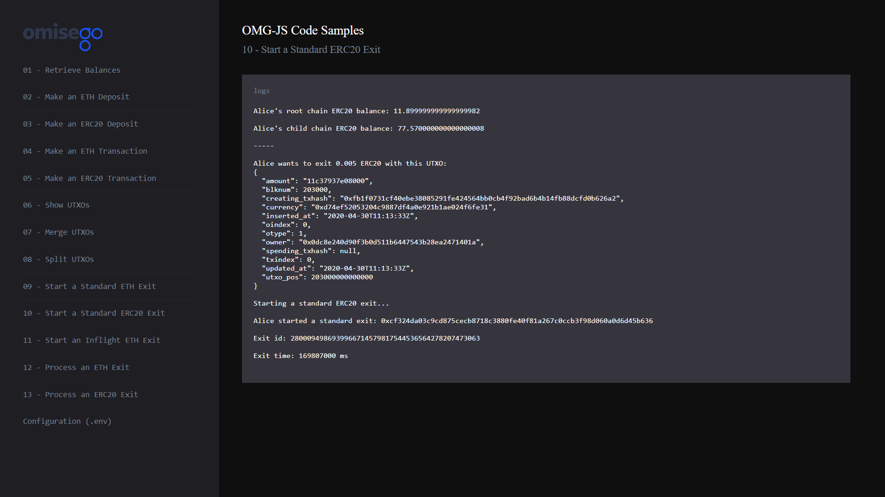

# Start a Standard ERC20 Exit to the root chain

_By the end of this tutorial you should know how to start a standard ERC20 exit to the root chain._

## Intro

The example uses `startStandardExit` and `getStandardExitId` functions provided by the `Rootchain` module of the `omg-js` library to start a standard ERC20 exit from the child chain back to the root chain. The process of starting an ERC20 exit is similar to starting a standard ETH exit. To see more details, refer to [Start a Standard ETH Exit](../05-exit-standard-eth/README.md) sample.

## Prerequisites

- At least 1 ERC20 UTXO in in Alice's OMG Network wallet. For creating a new UTXO, you can [make a deposit](../02-deposit-erc20/README.md), [receive a transaction](../03-transaction-erc20/README.md), or [split an existing UTXO](../04-utxo-split/README.md).

## Steps

1. App setup
2. Logging root chain and child chain balances for Alice
3. Logging ERC20 UTXOs for Alice
4. Checking the exit queue
5. Starting a standard exit

### 1. App setup

You can find the full Javascript segment of this tutorial in [exit-standard-erc20.js](./exit-standard-erc20.js). The first lines define dependent libraries, set up configs for child chain and root chain, define wallet's data for Alice.

```
import Web3 from "web3";
import { ChildChain, RootChain, OmgUtil } from "@omisego/omg-js";
import config from "../../config.js";

// setup for only 1 transaction confirmation block for fast confirmations
const web3 = new Web3(new Web3.providers.HttpProvider(config.eth_node), null, {
  transactionConfirmationBlocks: 1,
});
const rootChain = new RootChain({
  web3,
  plasmaContractAddress: config.plasmaframework_contract_address,
});
const childChain = new ChildChain({
  watcherUrl: config.watcher_url,
  watcherProxyUrl: config.watcher_proxy_url,
  plasmaContractAddress: config.plasmaframework_contract_address,
});

const aliceAddress = config.alice_eth_address;
const alicePrivateKey = config.alice_eth_address_private_key;
```

### 2. Logging root chain and child chain balances for Alice

Logging balances helps to understand the amount of funds available for submitting a standard exit. For performing this operation, use `getBalance` function provided by [web3.js](https://github.com/ethereum/web3.js) to retrieve the balance from the root chain (Ethereum Network), and `getBalance` function provided by [omg-js](https://github.com/omgnetwork/omg-js) to retrieve balance from the child chain (OMG Network). For a more detailed example, please refer to [Retrieve Balances](../01-balances/README.md) sample.

```
async function logBalances() {
  const aliceRootchainBalance = await OmgUtil.getErc20Balance({
    web3,
    address: aliceAddress,
    erc20Address: config.erc20_contract_address,
  });
  const aliceChildchainBalanceArray = await childChain.getBalance(aliceAddress);
  const aliceErc20Object = aliceChildchainBalanceArray.find(
    (i) =>
      i.currency.toLowerCase() === config.erc20_contract_address.toLowerCase()
  );
  const aliceChildchainBalance = aliceErc20Object ? aliceErc20Object.amount : 0;

  console.log(
    `Alice's root chain ERC20 balance: ${web3.utils.fromWei(
      String(aliceRootchainBalance),
      "ether"
    )}`
  );
  console.log(
    `Alice's child chain ERC20 balance: ${web3.utils.fromWei(
      String(aliceChildchainBalance),
      "ether"
    )}`
  );
}

async function exitErc20() {
  if (!config.erc20_contract_address) {
    console.log("Please define an ERC20 contract in your .env");
    return;
  }
  const aliceRootchainBalance = await web3.eth.getBalance(aliceAddress);
  const aliceEtherBalance = web3.utils.fromWei(
    String(aliceRootchainBalance),
    "ether"
  );
  if (aliceEtherBalance < 0.001) {
    console.log(
      "Alice doesn't have enough ETH on the root chain to start an exit"
    );
    return;
  }
  await logBalances();
  console.log("-----");
}
```

Example output:

```
Alice's root chain ERC20 balance: 0

Alice's child chain ERC20 balance: 5.46
```

### 3. Logging ERC20 UTXOs for Alice

Logging UTXOs helps to understand how many UTXOs you have available to submit an exit. For a more detailed example, please refer to [Show UTXOs](../04-utxo-show/README.md) sample.

You can exit only 1 UTXO at a time. Consider [merging multiple UTXOs](../04-utxo-merge/README.md) into 1 UTXO or [splitting UTXO](../04-utxo-split/README.md) if you don't want to exit all of your funds at once with a single UTXO.

```
// get a ERC20 UTXO and exit data
const aliceUtxos = await childChain.getUtxos(aliceAddress);
const aliceUtxoToExit = aliceUtxos.find(
  (i) =>
    i.currency.toLowerCase() === config.erc20_contract_address.toLowerCase()
);
if (!aliceUtxoToExit) {
  console.log("Alice doesn't have any ERC20 UTXOs to exit");
  return;
}

console.log(
  `Alice wants to exit ${web3.utils.fromWei(
    String(aliceUtxoToExit.amount),
    "ether"
  )} ERC20 with this UTXO:\n${JSON.stringify(aliceUtxoToExit, undefined, 2)}`
);
```

Example output:

```
Alice wants to exit 5.46 ERC20 with this UTXO:
{
  "amount": "4bc5d11259a20000",
  "blknum": 197000,
  "creating_txhash": "0xf17e76a1ff0a97fa89a770894720523297083b1d6a7375df55b09abbb1c19e00",
  "currency": "0xd74ef52053204c9887df4a0e921b1ae024f6fe31",
  "inserted_at": "2020-04-28T19:21:36Z",
  "oindex": 2,
  "otype": 1,
  "owner": "0x8b63bb2b829813ece5c2f378d47b2862be271c6c",
  "spending_txhash": null,
  "txindex": 0,
  "updated_at": "2020-04-28T19:21:36Z",
  "utxo_pos": 197000000000002
}
```

### 4. Checking the exit queue

Exits are processed in queues that contain tokens you can use to start an exit. Before you start an exit, the network has to verify that the exit queue for the token used in the UTXO exists. You can check that information with the `hasToken` function provided by the `Rootchain` module of the `omg-js` library.

If the exit queue doesn't have this token, you can add it with `addToken` function provided by the `Rootchain` module of the `omg-js` library.

```
// check if queue exists for this token
const hasToken = await rootChain.hasToken(config.erc20_contract_address);
if (!hasToken) {
  console.log(`Adding ${config.erc20_contract_address} exit queue`);
  await rootChain.addToken({
    token: config.erc20_contract_address,
    txOptions: { from: aliceAddress, privateKey: alicePrivateKey },
  });
}
```

Example output:

```
Adding 0xd74ef52053204c9887df4a0e921b1ae024f6fe31 exit queue...
```

### 5. Starting a standard exit

For starting a standard exit, use `startStandardExit` function provided by the `Rootchain` module of the `omg-js` library.

For checking the amount of time your exit will be available for processing, use `getExitTime` provided by the `Rootchain` module of the `omg-js` library. The time is returned in milliseconds. Feel free to convert it to a move convenient way.

```
// start a standard exit
console.log("Starting a standard ERC20 exit...");
const exitData = await childChain.getExitData(aliceUtxoToExit);
const standardExitReceipt = await rootChain.startStandardExit({
  utxoPos: exitData.utxo_pos,
  outputTx: exitData.txbytes,
  inclusionProof: exitData.proof,
  txOptions: {
    privateKey: alicePrivateKey,
    from: aliceAddress,
    gas: 6000000,
  },
});
console.log(
  "Alice started a standard exit: " + standardExitReceipt.transactionHash
);

const exitId = await rootChain.getStandardExitId({
  txBytes: exitData.txbytes,
  utxoPos: exitData.utxo_pos,
  isDeposit: aliceUtxoToExit.blknum % 1000 !== 0,
});
console.log("Exit id: " + exitId);

const { msUntilFinalization } = await rootChain.getExitTime({
  exitRequestBlockNumber: standardExitReceipt.blockNumber,
  submissionBlockNumber: aliceUtxoToExit.blknum,
});

console.log("Exit time: " + msUntilFinalization + " ms");
```

Example output:

```
Starting an ERC20 exit...

Alice started a standard exit: 0x7c60389cfcbb65544c5a8578278e6e2e8d187d747f09d6bcf42b0311dd36951d

Exit id: 14110729596408947310621462830800980122090046493

Exit time: 171864000 ms
```

## Running the sample

1. Install dependencies:

```
npm install
```

2. Create `.env` file, modify configurations with required values (look at [.env.example](../../.env.example) or [README](../../README.md) of the `omg-js-samples` repo for details).

3. Run the app:

```
npm run start
```

4. Open your browser at [http://localhost:3000](http://localhost:3000).

5. Select `Start a Standard ERC20 Exit` sample on the left side, observe the logs on the right:


